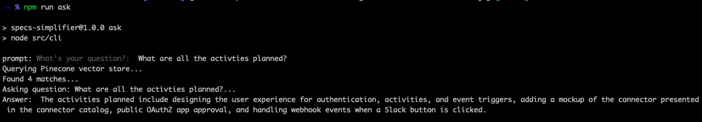

# Attempt to teach things to GTP and retrieve data


## Generating javascript hook
JS hooks can be generated by providing detailed explanations in `instructions.txt` file
Here is the command to generate hooks: `npm run instructioins`

**Example instructions:**
```
Write a post hook in cloud elements context based on examples to extract full name from vendor response.
Full name should be combination of first name and last name
The response from vendor looks like below json
{ "firstName": "Manas", "lastName": "Nilorout" }
Thrown an error in done callback if lastName is not part of the vendor response
Always call done function in each block
Always add detailed comments to the response code
Output only the javascript code in the response no additional text
```

## Generating test cases for hooks
Tests for JS hooks can be generated by providing detailed explanations in `instructions.txt` file
Here is the command to generate hooks: `npm run instructioins`
**Example instructions:**
```
```javascript
const requestParams = request_parameters || {};
let vendorPath = request_vendor_path || '';

const getDriveAndItemID = referenceID => {
  return {
    driveID: referenceID.split(' - ')[0],
    itemID: referenceID.split(' - ')?.[1]
  };
};

...
done({ request_vendor_path: vendorPath });
```

Generate test cases for above script using ava
The test cases must start with below typescript code
```typescript
import * as fs from 'fs';
import test from 'ava';
import { bodyExecute } from '@cloudelements/denali';

const hook = fs.readFileSync(
  'YUOR_HOOK_FILE_LOCATION.js',
  'utf-8'
);
```
Just output the typescript code, do not provide any strings apart from that
```